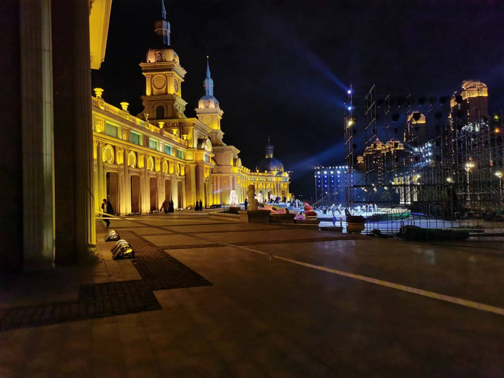

<h1> Hey! Nice to see you.</h1>

Welcome to my GitHub!   I'm Yinghao Zhang, Ph.D. candidate at Harbin Institute of Technology, China. I'm researching MR image reconstruction, and dynamic MRI specifically, and I'm also focusing on the inverse problems in computer vision and math. 

<h3>Things I code with</h3>

  
  
  
  
  
  

<h3>Things I'm learning to code with</h3>

  
  
  

<h3>My Best Open source projects</h3>
<table>
  <thead align="center">
    <tr border: none;>
      <td><b>🎁 Projects</b></td>
      <td><b>⭐ Stars</b></td>
      <td><b>📚 Forks</b></td>
      <td><b>🛎 Issues</b></td>
      <td><b>📬 Pull requests</b></td>
    </tr>
  </thead>
  <tbody>
    <tr>
      <td><a href="https://github.com/yhao-z/HIT-PowerPoint"><b>HIT-PowerPoint</b></a></td>
      <td></td>
      <td></td>
      <td></td>
      <td></td>
    </tr>
    <tr>
      <td><a href="https://github.com/yhao-z/TMNN"><b>TMNN (Tensor Nuclear Norm)</b></a></td>
      <td></td>
      <td></td>
      <td></td>
      <td></td>
    </tr>
    <tr>
      <td><a href="https://github.com/yhao-z/UnrollingNets-dMRI"><b>UnrollingNets-dMRI</b></a></td>
      <td></td>
      <td></td>
      <td></td>
      <td></td>
    </tr>
    <tr>
      <td><a href="https://github.com/yhao-z/SVD-inv"><b>SVD-inv (Diff. SVD)</b></a></td>
      <td></td>
      <td></td>
      <td></td>
      <td></td>
    </tr>
  </tbody>
</table>
<h3>My latest pubs</h3>
<ul>
  <li><a href="https://doi.org/10.1016/j.mri.2025.110337"><b>JotlasNet: Joint tensor low-rank and attention-based sparse unrolling network for accelerating dynamic MRI</b></a> <i>Y. Zhang, H. Gui, N. Yang, Y. Hu. Magnetic Resonance Imaging, 118, 110337, 2025.</i></li>
  <li><a href="https://arxiv.org/abs/2411.14141"><b>Differentiable SVD based on Moore-Penrose Pseudoinverse for Inverse Imaging Problems</b></a> <i>Y. Zhang, Y. Hu. arXiv preprint arXiv:2411.14141, 2024.</i></li>
  <li><a href="https://doi.org/10.1016/j.compbiomed.2024.108034"><b>T2LR-Net: An unrolling network learning transformed tensor low-rank prior for dynamic MR image reconstruction</b></a> <i>Y. Zhang, P. Li, Y. Hu. Computers in Biology and Medicine, 170, 108034, 2024.</i></li>
  <li><a href="https://ieeexplore.ieee.org/abstract/document/10635375"><b>Deep image-pass filter for accelerating dynamic MRI</b></a> <i>Y. Zhang, C. Zhou, Y. Hu, Y. Hu. IEEE ISBI, 1–4, 2024.</i></li>
  <li><a href="https://ieeexplore.ieee.org/abstract/document/10635267"><b>Alternating Unrolling Network Of Jointly Low-Rank And Sparse Tensor For Accelerating Dynamic MRI</b></a> <i>Y. Zhang, Y. Hu, C. Zhou, Y. Hu. IEEE ISBI, 1–4, 2024.</i></li>
</ul>
<h3>Lovely Harbin</h3>

Above is the Harbin I've seen on 2022/09/15 That night I almost lost my cell phone and Y left Harbin tomorrow.

<h3>Where to find me</h3>

    

------------
<!-- 
This <i>README</i> file is generated <b>every 3 hours</b>! Last refresh: Monday, 24 October, 06:52 CEST <a href="https://medium.com/@th.guibert/how-to-create-a-self-updating-readme-md-for-your-github-profile-f8b05744ca91">Create your own here!</a>

  
 -->
